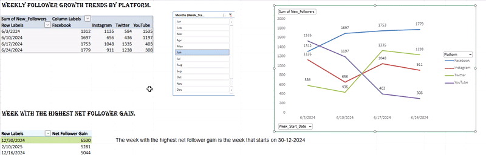

# 🚀 Strategic Social Media Analytics: ROI & Performance Dashboard

> **"Turning static data into dynamic insights."** This project is an interactive analytical tool designed to evaluate the social media ecosystem of a global beverage brand (**Pepsi**).

---

## 📊 Dashboard In Action
*Below is a demonstration of the interactive Slicers allowing stakeholders to drill down.*

---

## 📌 Executive Summary
**Author:** Mahesh Katula  
**Focus:** Digital Marketing Strategy, ROI Optimization, Campaign Performance  

In a digital landscape saturated with content, data-driven strategy is key to visibility. The primary objective of this analysis was to move beyond vanity metrics and understand the **Return on Ad Spend (ROAS)** across **Facebook, Instagram, Twitter, and YouTube**.

By engineering an interactive Excel model, I identified that while budget allocation favored video-heavy platforms, **Instagram** provided the highest efficiency ratio (5.7% Engagement Rate), suggesting a need for immediate strategic realignment.

---

## 🎥 Full Project Walkthrough
I have recorded a deep-dive video explaining the data logic, the "Instagram Efficiency Paradox," and strategic recommendations.

### [▶️ Click Here to Watch the Analysis Video](https://drive.google.com/file/d/1e-KwhWrpeNGaI4--_YquDjqIlHGraPyg/view?usp=sharing)

---

## 📂 Project Deliverables
| File Name | Description |
| :--- | :--- |
| **`Social_Media_Analytics_Dashboard.xlsx`** | The complete interactive dashboard. Features dynamic **Slicers**, **Pivot Charts**, and **Calculated Fields**. |

---

## 🛠️ Technical Implementation
This dashboard transforms raw data into business intelligence using:
* **Interactive Slicers:** Engineered a user interface allowing dynamic filtering by *Platform*, *Month*, and *Content Type*.
* **Advanced Pivot Tables:** Aggregated multi-dimensional data to calculate `Average Engagement` vs. `Total Impressions`.
* **Custom Metrics:** Created calculated fields for **Efficiency Ratios** (Engagement / Ad Spend).
* **Trend Smoothing:** Applied moving averages to follower growth data to filter out daily volatility and visualize organic lift.

---

## 📊 Strategic Insights & Findings

### 1️⃣ The Efficiency Paradox (Platform ROI)
* **Observation:** Budget allocation was highest for **YouTube** and **Twitter** (Video-centric).
* **Data Reality:** **Instagram** delivered the highest **Engagement Rate (~5.7%)** and the strongest organic follower growth, despite lower spend.
* **Strategic Implication:** The Cost Per Interaction (CPI) on Instagram is significantly lower, indicating an arbitrage opportunity.

### 2️⃣ Content Strategy & Hashtag Optimization
* **Viral Drivers:** Analysis of hashtag volume vs. interaction revealed that **`#PepsiCoRefresh`** and **`#ThirstyForMore`** are the primary drivers of viral reach.
* **Format Performance:**
    * **Carousels & Static Images** outperformed Video in direct community interaction (Likes/Comments).
    * **Recommendation:** Shift content production budget towards high-quality static assets for better cost-efficiency.

### 3️⃣ Campaign Impact Analysis
Three major campaigns were analyzed for performance uplift:
| Campaign | Objective | Key Outcome |
| :--- | :--- | :--- |
| **`SummerSplash`** | Awareness | Achieved highest **Avg. Impressions (38k)**; successfully maximized top-of-funnel visibility. |
| **`NewYearRefresh`** | Acquisition | Drove the peak growth week (**Dec 30, 2024**), adding **6,530** net new followers. |
| **`FestiveRadiance`** | Engagement | Showed consistent engagement uplift during the active campaign window. |

---

## 💡 Recommendations for Stakeholders
Based on the quantitative analysis, the following strategic pivots are recommended:

1.  **Budget Reallocation:** Shift **15-20%** of Ad Spend from Twitter to **Instagram**. The data proves Instagram yields a higher ROI per marketing dollar.
2.  **Content Mix:** Reduce the frequency of high-production cost Videos on Twitter; replace them with **Carousel** formats which show higher engagement rates.
3.  **Hashtag Strategy:** Standardize the use of **`#ThirstyForMore`** across all organic posts to unify the brand conversation.
4.  **Launch Timing:** Leverage the **End-of-Year** window (validated by `NewYearRefresh` data) for major product launches, as audience receptivity is at its peak.

---

## 📬 Connect
**Mahesh Katula** *Emerging Data Scientist | Next-Gen Analytics Enthusiast* 
